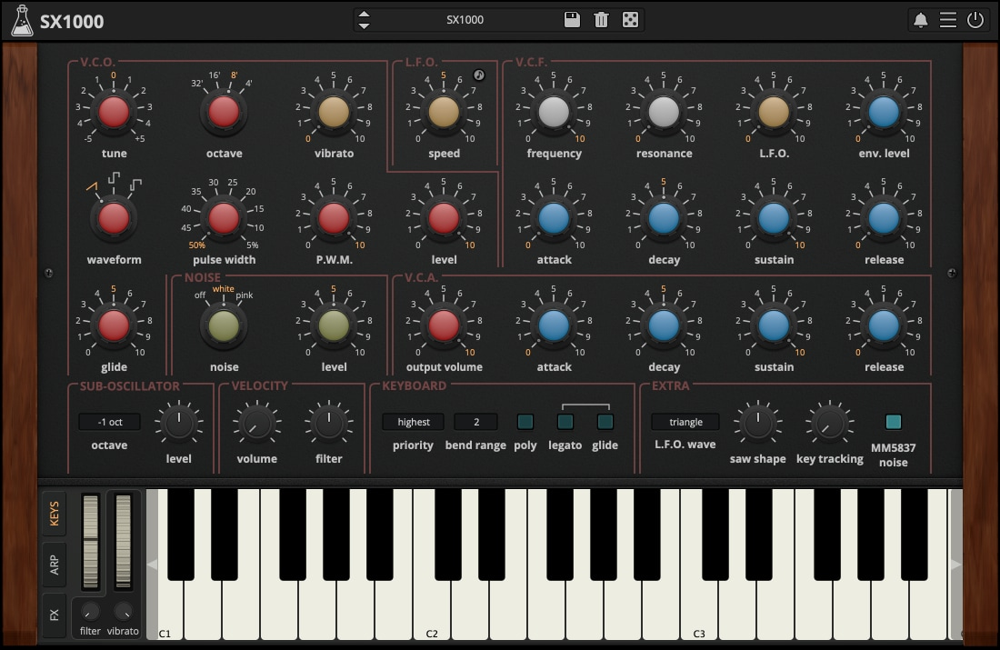

# Compétition Web

Dans cette compétition, vous allez devoir créer un synthétiseur! 

Voici un **exemple** pour vous inspirer:



## Version de Node et Npm pour les projets
Node: 24.13.0
Npm: 11.6.2

## Frontend (React 19.2)

Pour démarrer le frontend:
```bash
cd frontend/
npm install

npm start
``` 

Le but du challenge est de créer un synthétiseur! Le site web doit avoir des touches de piano ainsi qu'un sélecteur de "presets". 
Chaque note fait par les touches du piano vont produire un son en fonction du preset sélectionné. 

Le backend a une base de données sous le format d'un fichier json avec plusieurs [presets](common/types/Preset.ts). 

Voici les tâches à compléter pour le frontend en ordre de priorité:
1. Être capable de sélectioner le "preset"
1. Être capable de jouer de la musique avec des touches de piano. (Afficher au moins 3 octaves)
1. Être capable de changer les valeurs des presets.
1. Être capable de sauvegarder les nouvelles valeurs des presets dans le backend.
1. Être capable de créer de nouveaux presets et de les sauvegarder dans le backend.
1. Être capable de supprimer des presets.


Pour vous aider à commencer, des services ont déjà été créés dans le frontend:
- `AudioService`: Service permettant de jouer des notes. 
- `PresetService`: Service permettant de récupérer des presets du backend.
- `BackendService`: Service simplifiant la communication avec le backend.

Ainsi qu'une énumération des notes de musique avec leurs fréquences correspondante: [Note](./frontend/src/types/Notes.ts)

## Backend (Express 5.0)

Pour démarrer le backend:
```bash
cd backend/
npm install

npm start
``` 

Le backend est ensuite accessible via http://localhost:3030/

Le backend a déjà des fonctions implémentées, notamment:
- GET `/presets` : Permet de récupérer tous les presets
- GET `/presets/count`: Permet de récupérer le nombre de total de presets
- GET `/presets/:id`: Permet de récupérer un preset par son `id`
- PATCH `/presets/:id`: Permet de modifier un preset

Et des fonctions que vous devez implémenter:
- POST `/presets`: Permet de créer des nouveaux presets
- DELETE `/presets/:id`: Permet de supprimer des presets

Vous devez implémenter les fonctions manquantes du backend dans ce fichier [PresetRoutes.ts](backend/routes/presets/PresetsRoute.ts)